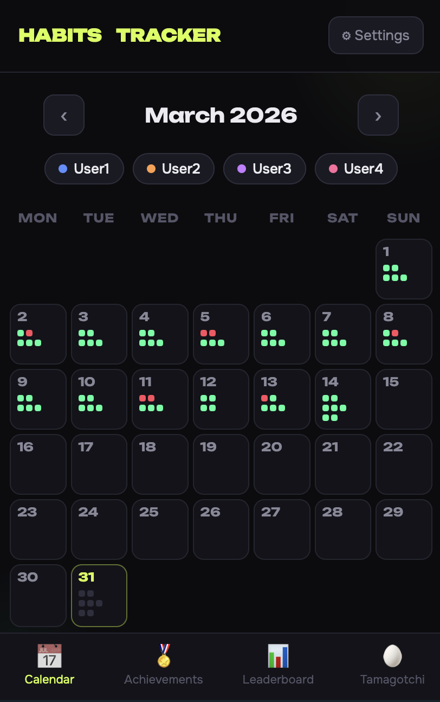
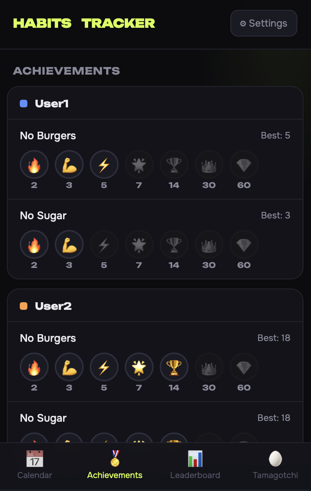
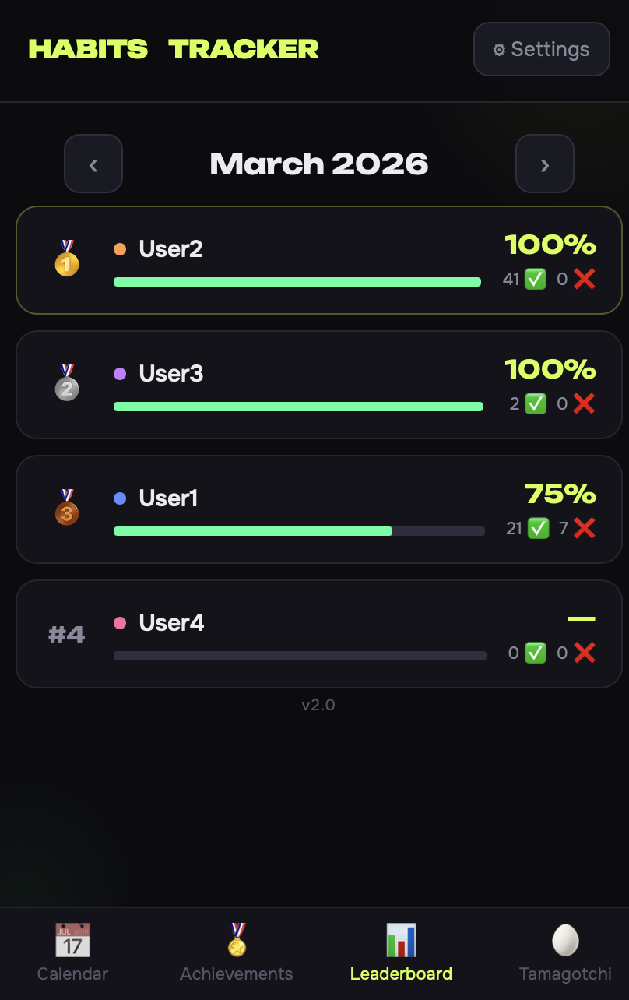
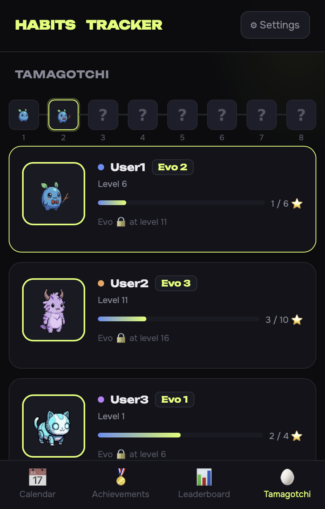
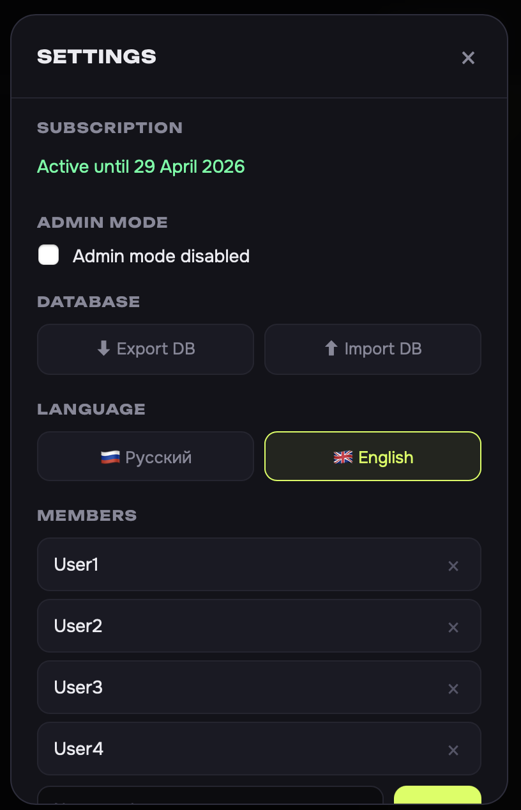

# Habits Tracker v2.0

Telegram Mini App for tracking habits in group chats. Group members share a common calendar, view streaks, achievements, and leaderboard.

---

## Screenshots







---

## Requirements

- Docker + Docker Compose
- Domain with HTTPS (mini app requires HTTPS)
- Reverse proxy (nginx, Caddy, etc.) pointing your domain to the container port

---

## BotFather Setup

### 1. Create a bot

```
/newbot
```

Save the token — it goes into `BOT_TOKEN`.

### 2. Disable Group Privacy

```
/mybots → select bot → Bot Settings → Group Privacy → Turn off
```

Without this the bot won't see messages in groups.

### 3. Configure Mini App

```
/mybots → select bot → Bot Settings → Configure Main Mini App → Enable
→ Enter the URL: https://your-domain.com
```

### 4. Fill in description (optional)

```
/mybots → select bot → Edit Bot → Edit About
```

Example:
```
🏋️ Трекер привычек / Habits tracker

Добавь в группу → /start → мини-приложение
Привычки, стрики, рейтинг

Add to a group → /start → mini app
Habits, streaks, leaderboard
```

Place the welcome image for the first `/start` at `assets/hello.jpg`.

---

## Installation

### 1. Clone the repository

```bash
git clone <repo-url>
cd habits-tracker
```

### 2. Configure environment variables

Copy `.env.example` to `.env` and fill in all fields:

```bash
cp .env.example .env
```

| Variable | Description |
|---|---|
| `BOT_TOKEN` | Bot token from BotFather |
| `WEBAPP_URL` | HTTPS URL of your domain, e.g. `https://habits.example.com` |
| `YOOKASSA_SHOP_ID` | Shop ID from YooKassa dashboard |
| `YOOKASSA_SECRET` | API secret key from YooKassa dashboard |
| `SUBSCRIPTION_PRICE` | Subscription price in RUB (default `199.00`) |
| `TRIAL_SECONDS` | Trial period in seconds (`604800` = 7 days) |
| `ADMIN_USER_IDS` | Telegram IDs of admins, comma-separated |
| `PG_PASSWORD` | PostgreSQL password — choose any strong password |
| `TZ` | Timezone for logs, e.g. `Europe/Moscow` |

Other PG variables (`PG_HOST`, `PG_PORT`, `PG_DB`, `PG_USER`) can be left as defaults.

### 3. Configure reverse proxy

Proxy `https://your-domain.com` → `http://localhost:8092`.

### 4. Start

```bash
docker compose up -d
```

---

## Usage

### Connecting a group

1. Add the bot to a group
2. Send `/start` in the group — the bot will send an **Open tracker** button
3. Tap the button — the Mini App opens inside Telegram

On the first `/start` the bot sends a welcome message with an image.

### In the Mini App

**Calendar** — main screen. Tap any day to mark habit completion (✅ / ❌) for each member.

**Achievements** — streaks for each habit. Badges unlock at streak milestones: 🔥 2 · 💪 3 · ⚡ 5 · 🌟 7 · 🏆 14 · 👑 30 · 💎 60 days in a row.

**Leaderboard** — members sorted by completion % for the selected month. 🥇🥈🥉 for top 3.

### Settings (⚙ button)

- **Members** — add / remove members
- **Habits** — add / remove habits per member
- **Database** — export and import data as JSON
- **Language** — Russian / English

---

## Data & Logs

```
habits-tracker/
└── logs/
    ├── group_<id>.log   # group chat logs
    └── direct_<id>.log  # private chat logs
```

Log format:
```
[2026-03-07 12:00:00 MSK] Ivan (@ivan, id=12345): added habit "Sport" for person "Ivan" in group 'My Group'
[2026-03-07 12:01:00 MSK] Ivan (@ivan, id=12345): marked "Sport" on 2026-03-07 as ✅ in group 'My Group'
```

---

## Subscription Management (psql)

Connect to the database:
```bash
docker compose exec postgres psql -U habits -d habits
```

### Grant subscription

```sql
-- For 30 days
INSERT INTO subscriptions (user_id, chat_id, paid_until)
VALUES (<user_id>, <chat_id>, NOW() + INTERVAL '30 days')
ON CONFLICT (user_id, chat_id) DO UPDATE SET paid_until = NOW() + INTERVAL '30 days';

-- Forever (100 years)
INSERT INTO subscriptions (user_id, chat_id, paid_until)
VALUES (<user_id>, <chat_id>, NOW() + INTERVAL '100 years')
ON CONFLICT (user_id, chat_id) DO UPDATE SET paid_until = NOW() + INTERVAL '100 years';
```

### Check subscription

```sql
SELECT user_id, chat_id, trial_start, paid_until,
       CASE WHEN paid_until > NOW() THEN 'active' ELSE 'expired' END AS status
FROM subscriptions
WHERE user_id = <user_id>;
```

### Extend subscription

```sql
UPDATE subscriptions
SET paid_until = paid_until + INTERVAL '30 days'
WHERE user_id = <user_id> AND chat_id = <chat_id>;
```

### Reset to trial

```sql
UPDATE subscriptions
SET paid_until = NULL, trial_start = NOW()
WHERE user_id = <user_id> AND chat_id = <chat_id>;
```

### Revoke subscription

```sql
UPDATE subscriptions
SET paid_until = NOW() - INTERVAL '1 second'
WHERE user_id = <user_id> AND chat_id = <chat_id>;
```

### List all active subscriptions

```sql
SELECT s.user_id, s.chat_id, g.title, s.paid_until
FROM subscriptions s
LEFT JOIN groups g ON g.chat_id = s.chat_id
WHERE s.paid_until > NOW()
ORDER BY s.paid_until;
```

### View payments

```sql
SELECT payment_id, user_id, chat_id, status, created_at
FROM payments
ORDER BY created_at DESC
LIMIT 20;
```

---

## Update

```bash
docker compose down
git pull
docker compose up -d --build
```
